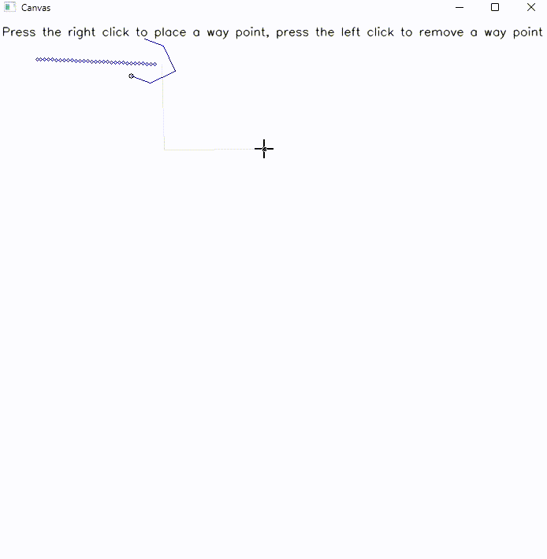
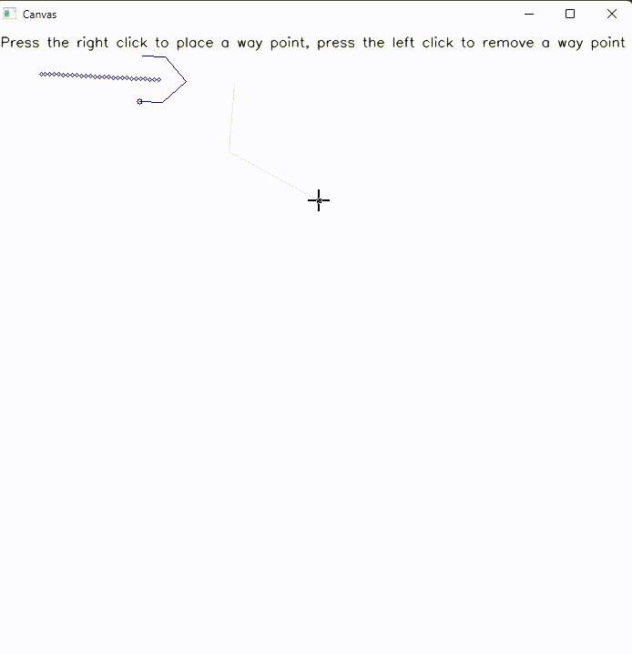
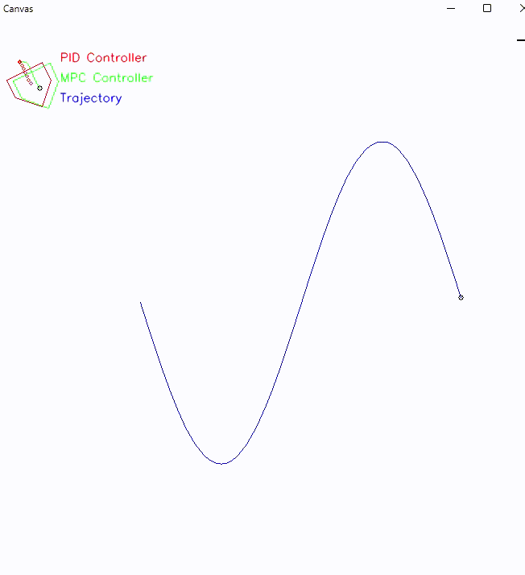

# Line-Follower

# Path Planning Project

This repository contains a Python-based project for implementing and simulating path-planning algorithms, including controller comparisons, parameter optimization, and utility functions for visualization.


## Features

- **Main Simulation**: Core logic for running simulations is implemented in `main.py`.
- **Controller Implementation**: Includes `controller.py` and `controller_comparison.py` for managing control algorithms.
- **Visualization Tools**: `draw.py` provides functions to render paths and other graphical outputs.
- **Parameter Configuration**: Adjustable parameters defined in `parameters.py`.
- **Utility Functions**: Helper functions included in `utils.py` to support computations and modularity.


## Setup and Installation

### Requirements:
- Python 3.x
- openCV
- Numpy (for mathematical calculations)

### Installation Steps:

1. **Clone the repository**:
   ```
    git clone https://github.com/Varun-Ajith/Line-Follower.git
   cd Line-Follower
   ```
2.  **Install required dependencies**: If you're using a virtual environment, activate it first and then install the required libraries:
   ```
    pip install -r requirements.txt
  ```
3. If `requirements.txt` doesn't exist, install the libraries manually:
   ```
   pip install numpy opencv-python scipy
   ```
4. **Run the simulation**:
   - To start the simulation, run the main script: ``` python main.py ``` , The simulation window will open, where you can interact with the robot.
   - To see the real time comparison of both controller, run the controller_comparison script: ``` python controller_comparison.py```.

## Usage

### 1. Define the Path

- **Right-click** on the canvas to place waypoints along the path you want the robot to follow.
- **Left-click** to remove any existing waypoints.

### 2. Select the Controller

Choose between **PID** and **MPC** controllers in the configuration file or simulation interface.

### 3. Tuning the Controller

#### PID Controller:
- Adjust PID parameters in the `car.py` or `controller.py` file to fine-tune the robot's response to path-following errors.
- Modify the proportional (Kp), integral (Ki), and derivative (Kd) values to improve the robot's accuracy.

#### MPC Controller:
- Configure the MPC settings in the appropriate file. Parameters to adjust may include:
  - Prediction Horizon
  - Control Horizon
  - Weight Matrices (Q, R)


### 4. Start the Simulation

- The robot will follow the defined waypoints using the selected controller.
- The simulation visualizes the robot's movement along the path, providing real-time feedback on position, speed, and controller performance.

---

## Video

| **PID**                                          | **MPC**                                          | **Comparison**                                   |
|--------------------------------------------------|--------------------------------------------------|--------------------------------------------------|
|                                |                                |                           |


## How it Works

The robot uses a **differential drive** configuration, where motion is determined by the speeds of its two wheels:

- **Left Wheel**: Controls the robot’s movement to the left.
- **Right Wheel**: Controls the robot’s movement to the right.

The controller minimizes the error between the robot's current position and the target path by adjusting the wheel speeds.

### PID Control
- **Proportional (Kp):** Reacts to the current error.
- **Integral (Ki):** Corrects accumulated past errors.
- **Derivative (Kd):** Anticipates future errors.

### MPC (Model Predictive Control)
The MPC controller predicts the robot's future trajectory and optimizes control actions over a prediction horizon by minimizing a cost function. Key features include:
- Ability to handle constraints on wheel speeds and robot dynamics.
- Predictive optimization to anticipate and avoid future errors.

## Contributions
If you'd like to contribute to this project, feel free to fork the repository, make your changes, and create a pull request. Contributions are welcome!

## License
This project is licensed under the MIT License - see the [LICENSE](LICENSE) file for details.

## Acknowledgements
Thanks to all the open-source libraries that made this project possible.
Special thanks to the contributors for their valuable inputs.
